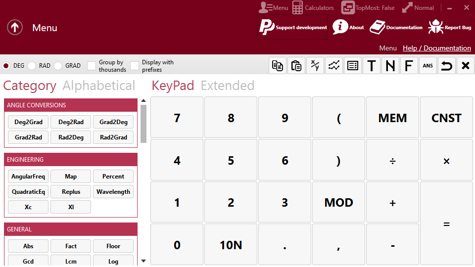
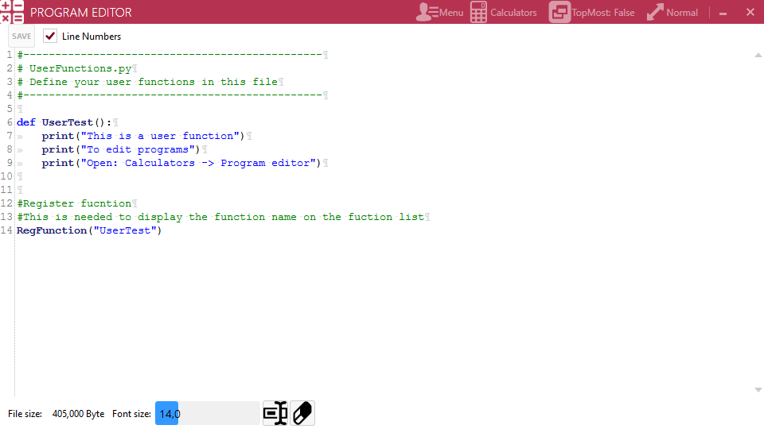

# Engineers calculator
An Engineering Calculator for Windows. Specifically designed for Electrical & IT Engineering at the moment.

In the Future it might be expanded to do other various engineering tasks. Releases are available in two formats: 

* Portable ZIP file: Unzip it & run from a writeable folder. These installers are hosted here, on [Github](https://github.com/webmaster442/ECalc/releases).
* [ClickOnce](https://en.wikipedia.org/wiki/ClickOnce) Installer: Easy install method, hosted on [Codeplex](https://ecalc.codeplex.com/releases).

NOTE: The Codeplex repository contains only the stable source as a downloadable zip & the ClickOnce installers.

## Features:

* Programmable & expendable with Python
* Sets & Statistics
* Fractions
* Complex numbers
* Matrix calculations
* Engineering functions
* Support for various number system inputs (Binary, Octal, Hexadecimal, Decimal, Roman)
* Supports Numbers in prefixed input.
* Number to text representation
* Plugin system for modules
* Calculator theme color can be switched at runtime

## Modules:

* Program editor
* Multimedia Calculators
* LM317 Calculator
* LED Forward current limiter resistor calculator
* 555 Timer calculator
* Logic function minimizer
* IP subnet calculator
* Currency rate converter (with live data)
* Unit system converter
* Visual trigonometry tool
*  Cutting speed calculator

## Requirements to run:

* Windows 7/8/10
* .NET Framework 4.5
* 10Mb Disk space

## Requirements to compile:

* Visual Studio 2015 Community or newer

## Screenshots:

